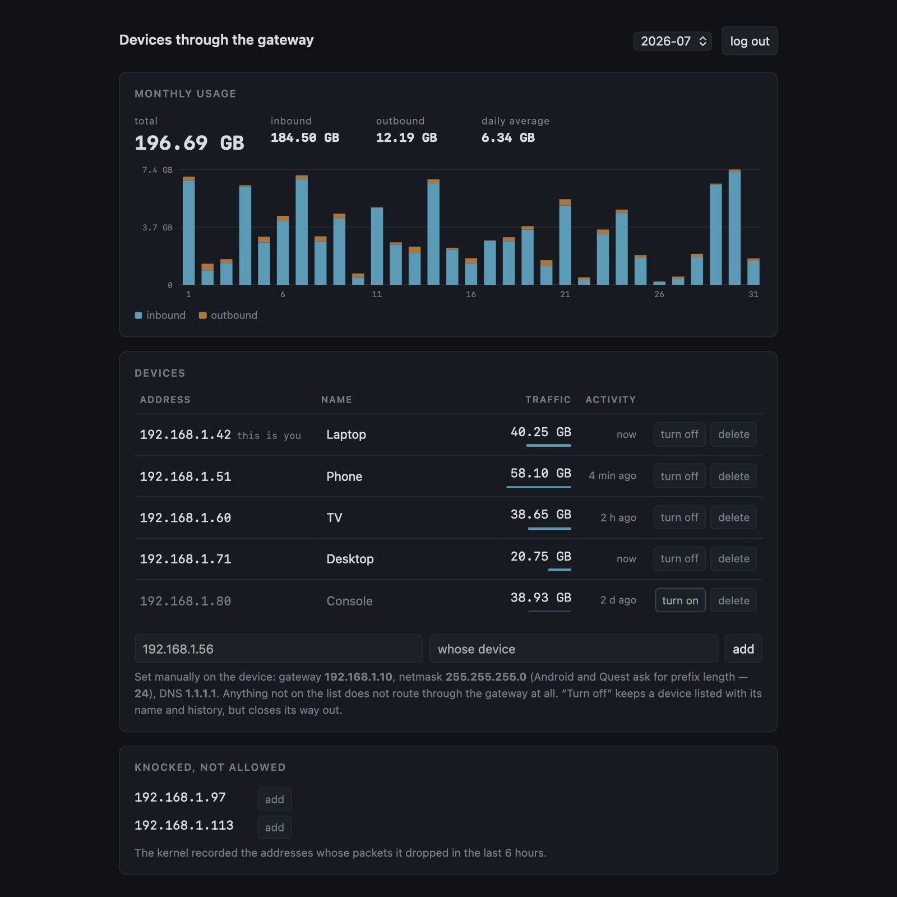

# gateway-acl

A small web panel that decides **which devices on the network may route through
this Linux host**, and shows how much traffic each of them used.

It works on any Linux machine that other devices use as their gateway: a spare
desktop, a single-board computer, a virtual machine, a router running a normal
distribution. It does not matter what it forwards into, a VPN tunnel or a plain
uplink. Either way, anyone who points at that address gets a free ride. This is
the allowlist that stops it.

Русская версия: [README.ru.md](README.ru.md).

```
device ──► this Linux host ──► uplink or tunnel (sing-box / WireGuard / any) ──► internet
                │
                └── gateway-acl decides who gets through
```



*Screenshot taken with made-up devices and traffic. None of it is real.*

## What it does

- **Allowlist by IP.** Not on the list, not routed. One nftables table, rebuilt
  atomically on every change.
- **Per-device traffic**, upload and download, counted per day and summed per
  month. There is a daily chart with the running total drawn over it, the last
  24 hours, a bar per month, a sparkline in every row, and any single device on
  its own: open its row and press *Show in chart*. All inline SVG, no external
  libraries.
- **Live speed.** The poll that reads the counters also divides them by the
  time it covered, so each row shows what that device is pulling right now.
- **The machine itself.** Processor, memory, swap, disk, load, temperature,
  uptime and the interface's throughput, read straight out of `/proc` and
  `/sys`.
- **Turn a device off** without deleting it. It keeps its name and history.
- **...or off for a while.** Open its row and pick fifteen minutes, an hour,
  three, eight, or until seven in the morning. When the time is up, the device
  goes back to the state it was in. It works the other way round too: a device
  that is off can be let out for an hour.
- **...or past the VPN instead of off.** A switch in the same row sends one
  device around the tunnel. It keeps its internet, straight out through the
  gateway, while everything else stays inside. Its packets carry an fwmark the
  tunnel ignores: `"vpn_mark"` in `config.json`, `8228` (`0x2024`) for sing-box,
  `51820` for a stock wg-quick, `0` to hide the switch. Read that number off
  your own host, because the neighbouring mark does the opposite. The mark goes
  on the hardware address, so IPv4 and IPv6 leave together. Half a device out
  of the tunnel is a device every site still places at the exit node. See
  [docs/singbox.md](docs/singbox.md).
- **Devices follow their hardware address.** If DHCP hands a known device
  another address, the entry moves there with its name, its switch and all of
  its traffic history, instead of quietly becoming a rule for nobody.
- **Let everyone in for a while.** A control under Settings suspends the list
  for five minutes, fifteen or an hour. Useful for guests, or for working out
  why something will not connect. Accounting carries on and the kernel keeps
  recording who came, so when the window shuts, everything that used it is in
  the strangers list below and one click from being allowed for good.
- **Manage tunnels from Settings.** Add or remove any number of HTTPS
  subscriptions, or save WireGuard and AmneziaWG `.conf` profiles. Profiles are
  created disabled. Enabling one validates it and switches the managed backend,
  with a rollback if the candidate does not come up. A *check* button says
  whether a profile works **without** switching the gateway onto it, so you can
  work through a pool of subscriptions and profiles without breaking anything.
  A subscription can be expanded to pick its nodes by hand.
- **Turn everyone off at once**, except the address that pressed the button.
  The same button brings them back.
- **A warning when an address is answering as somebody else.** The entry is
  bound to one piece of hardware and a different one is on that address now, so
  the rule written for your tablet is currently the rule for whatever took its
  place.
- **Unknown devices.** The kernel records who it dropped into a timeout set.
  The panel lists them with the hostname from the DHCP leases, the hardware
  address from the ARP cache, and who made the thing: the system's IEEE list if
  it ships one, a short built-in table if not. It says how long ago each one
  last knocked, and allows one in a click. The field for a new address offers
  everything the system knows about the network, so nothing has to be typed
  from memory.
- **Rename devices** inline, or take the name the device gives the network. It
  is offered at the end of the field while that is still empty. Renaming never
  touches nftables, so counters survive. Sort the list by address, name,
  traffic, current speed or last seen, pick from a menu and flip the direction
  with one button, filter by address, name or hostname, and download the
  selected month as CSV.
- **Update notice, and the button under it.** Once a day the panel asks GitHub
  for the latest release tag and shows a banner if yours is older. *Install now*
  fetches that release and runs the installer with the answers you already gave,
  so an upgrade needs no terminal. One checkbox turns it off. *Check for an
  update* next to it asks right now, even with the notice switched off. Use it
  sparingly: GitHub allows sixty unauthenticated requests an hour from one
  address, so the panel refuses a second check within a minute.
- **A browser notification when a release lands.** A second checkbox under the
  first. While a panel tab is open, a new version arrives as a desktop
  notification instead of waiting to be noticed. Browsers only hand out
  notifications in a secure context, so over plain `http://` on a LAN address
  there are none, and the tab title carries a dot instead. A version is
  announced once, not on every poll.
- **Settings in the corner.** Language, update notice and its notification,
  poll interval, LAN interface, network, gateway address, port and the
  password: all of `config.json` behind one form, validated before it is
  written. Next to the save button there is a reboot for the gateway itself. It
  asks first.
- **A nightly reboot** on a switch. Off by default, 05:30 when you turn it on.
- **Light and dark**, whichever the machine looking at it is set to, or pick one
  yourself in Settings: Auto, Light or Dark, remembered in this browser. Kept on
  a phone's home screen it gets its own icon and paints the status bar to match.

Everything is Python standard library and inline SVG. No pip, no npm, no CDN,
so the panel works with no internet at all.

## Requirements

- Linux with systemd and `nftables`
- Python 3.9+ (standard library only)
- For managed tunnels: `sing-box` 1.12+, `wg-quick` and `awg-quick`. The
  installer offers to install them. Plain NAT or another route you already
  configured still works without any of them.

## Install

```bash
git clone https://github.com/ChasoniCK/gateway-acl
cd gateway-acl
sudo ./install.sh
```

The first question is the language, Russian or English. It sets both the
installer's own output and the panel's interface, and is remembered in
`config.json`, so an upgrade never asks again. To skip the question:

```bash
sudo ./install.sh --lang en
```

The installer detects your LAN interface, address and subnet, offers to enable
`ip_forward`, asks for a panel password, and on a first install lists the
devices currently visible in the ARP table so you can allow them before the rule
takes effect. It refuses to enable anything until `panel.py --selftest` passes
and the kernel accepts the generated ruleset.

A step of its own installs the programs the panel runs tunnels with:
`sing-box` (1.12 and newer only, since older ones cannot read the config the
panel writes, so where a distribution ships an outdated one the published build
for this architecture goes into `/usr/local/bin` along with a systemd unit),
`wireguard-tools` and, where it is packaged at all, `amneziawg-tools`. Nothing
in that step can fail the install: an upstream that happens to be down must not
cost you your access control. The installer still does not fetch a subscription
or rewrite a tunnel's config. That is the panel's job alone.

Tunnel setup is under **Settings → Tunnels**. If a *saved* profile is missing
the program it needs, that program is named in red above the list, because the
profile's *enable* will not work. A kind you do not use yet is mentioned where
you would reach for it, under the type selector in the add form.

`amneziawg-tools` is in no distribution's own archive: Ubuntu has it in the
project's PPA, Arch in the AUR. The installer offers both, but only with a
person at the keyboard. A third-party package source and a build of somebody
else's PKGBUILD are not decisions to make on your behalf during a `--yes`
upgrade. An AUR build runs as whoever typed `sudo` (`makepkg` refuses to run as
root) and needs `paru` or `yay`. If pacman's database is locked at that moment,
because another update is running or a killed `pacman` left the lock behind, the
installer waits a minute and then says which of the two it is, instead of
sitting on `:: Pacman is currently in use` for good.

Packages are installed one at a time rather than as one transaction.
`amneziawg-tools` sits in a binary repository on some of these systems while
`amneziawg-go` is AUR-only, and one failing must not take the other with it.
That is exactly how a host ends up with an `awg-quick` that has nothing to build
an interface with. That state now has a name: neither the installer nor the
panel counts the tools alone as ready, because `awg-quick up` on such a host
prints `Unknown device type` and stops.

What gets installed is `amneziawg-tools` and `amneziawg-go`. The kernel module
`amneziawg-dkms` is attempted only where headers for the running kernel are
present, and its failure changes nothing: `awg-quick` picks the module when it
is there and the userspace implementation when it is not. On a distribution with
its own kernel that is the difference between working and rebuilding after every
kernel upgrade. The cost is speed, and the installer says which of the two you
ended up with. If nothing could be installed, it prints which system this is.

Each subscription has its own HTTPS link and an optional exclusion regular
expression. Several may be enabled together: their nodes are merged into the
single sing-box `proxy` group, while each source can be refreshed or deleted
independently. The group is a `urltest`, so excluding domestic nodes still
matters. Otherwise a nearby node wins on latency and the tunnel exits at home.

Read the names before writing the expression. A provider's name says where the
node is *entered*, not where it leaves. `Россия (Reality)` comes out in Russia,
and `Россия через Финляндию` goes in there and out in Finland. The second kind
is often the only kind that works, because the direct foreign addresses are what
the ISP blocks. `Россия \(` excludes the first and keeps the second; `Росс`
excludes both and can leave you with nothing that connects.

The panel writes two things and nothing else: outbounds tagged for their
subscription profile, and the member list of the `proxy` group. Routing rules,
DNS, inbounds and any outbound you wrote by hand survive a refresh unchanged,
and the config it replaces is kept beside the new one. A node this sing-box
cannot use, an `xhttp` transport for instance, is reported and skipped, never
written. On a host with no config at all a working one is generated: `tun` with
`auto_route` and `auto_redirect`, DNS hijacked into the tunnel, private
destinations going out `direct`.

WireGuard and AmneziaWG profiles must carry a full IPv4 route. `Table = off`, a
custom table and all `PreUp`/`PostUp`/`PreDown`/`PostDown` hooks are refused,
and so is `SaveConfig`. A missing `::/0` is shown as an IPv6 warning. The panel
uses fixed `wg-quick`/`awg-quick` commands and never runs text from a profile as
a shell command.

A subscription can be **expanded**, with the *nodes* button, to pick which of
its servers to connect to. A node turned off here never reaches the
configuration, so the `urltest` group cannot choose it. That is the same thing
the exclusion regular expression does, but one node at a time and without
guessing a pattern. Each node carries the mark from the last check, *answers* or
*silent*, so you choose by looking at the result rather than at the name. The
selection lives in the subscription's owner-only file beside its link and
survives a refresh. It is keyed on the node's name rather than its position in
the list, and a refresh only prunes what the provider has stopped listing. There
is no such thing as an empty subscription: at least one node has to stay. To use
none of it, disable or delete the profile.

A **check** button sits on every profile and switches nothing. It answers
"would this one work" while the current tunnel keeps running. A subscription is
built into a configuration of its own, handed to `sing-box check` to read, and
its nodes (up to 24 distinct addresses, all at once) are knocked on over TCP.
The list then says "checked: 21 of 24 answered". A WireGuard or AmneziaWG
profile is brought up on a scratch interface carrying a single route to
`192.0.2.1`, an address from the block reserved for documentation, where nothing
real is ever sent. The panel sends one packet through it, waits for the
handshake, and deletes the interface. That is how you collect a pool of profiles
and sort them into working and not, without switching the whole gateway onto
each one.

Only one backend class is active at a time: the aggregate sing-box
subscriptions, one WireGuard profile, one AmneziaWG profile, or direct routing.
A switch first closes forwarded traffic, checks the candidate, records the real
fwmark, and then reopens it. A tunnel that was just started is given up to
twenty seconds to appear, because `systemctl restart` returns as soon as the
process is running and sing-box installs its route and mark a moment later.
Checking straight away used to read a healthy tunnel as a failed one and roll
the whole switch back. Failure restores the previous config, service and mark;
if that rollback fails, forwarding stays closed. A crash outside a managed
switch is noticed on the next panel poll, not instantly.

Metadata is stored in `/etc/gateway-acl/tunnels.json`. Subscription links,
cached bodies and quick configs stay in owner-only files under
`/etc/gateway-acl/tunnels/` and are never returned to the browser. An existing
`sub.url`/`sub.exclude` installation is migrated once without touching its
running sing-box service. Press *refresh* in the panel when you are ready to let
the panel take ownership. See [docs/singbox.md](docs/singbox.md).

Re-running the installer upgrades the code in place, leaving your device list
and statistics alone. It re-uses every answer already in `config.json` rather
than detecting the host again, which is what makes `--yes` safe on a machine you
configured by hand.

```bash
sudo ./install.sh --uninstall   # remove service and rules, keep data
sudo ./install.sh --purge       # also delete /etc/gateway-acl
```

## Client setup

On each device, set manually:

| | |
|---|---|
| Gateway | the address of this host |
| Netmask | your LAN mask (Android and Quest ask for prefix length instead) |
| DNS | a public resolver such as `1.1.1.1` |

Do not point clients at the gateway's own IP for DNS. See
[docs/singbox.md](docs/singbox.md) for why that quietly fails.

## Security

The panel is reachable from the whole LAN and protected by **one password**.

- Stored as scrypt with a random salt, never in plaintext. The installer reads
  it and pipes it straight into `panel.py --set-password`.
- The session cookie is `HttpOnly`, `SameSite=Strict`, seven days. Sessions are
  kept in `sessions.json` (mode 0600) as digests, so they survive a restart of
  the service and an upgrade no longer signs everyone out. The file on its own
  opens nothing: what is in it cannot be presented as a cookie. Logging out
  really does revoke.
- Five wrong guesses from one address, and that address waits a minute.

**It is plain HTTP.** The password crosses the network unencrypted. On a small
network you control that is a reasonable trade; on one you do not, it is not.
Put it behind a TLS reverse proxy, or reach it through an SSH tunnel:

```bash
ssh -L 8080:127.0.0.1:8080 you@gateway
```

Anyone who knows the password can change the allowlist. There are no roles and
no audit log. It is built for a network small enough that everyone with the
password is meant to have it.

**The update button runs code as root.** When the banner says a newer release is
tagged, *Install now* downloads that release from `codeload.github.com` and runs
`install.sh --yes` with the answers already on disk. The address is built from
constants: only the tag comes off the network, and it has to look like a version
or nothing is fetched at all. The archive has to declare the version that was
announced and pass its own selftest before anything on the host is replaced, and
what happened is in `/etc/gateway-acl/update.log`. It is still one more thing the
panel password buys: whoever knows it can make the gateway install a release.
The reboot button has always been the same kind of power. Better to say so than
let you find out.

**The panel reaches out once a day, and whenever you press the button.** It
makes a GET to `api.github.com/repos/ChasoniCK/gateway-acl/releases/latest` for
the latest release tag. Nothing about you is sent, but the request itself is
visible to GitHub: your address and the time. The check is on by default, the
switch is under **Settings** in the corner of the panel, and it takes effect at
once. Beside it, *check for an update* makes that same request on demand. That
is the only outbound traffic the panel ever has, so it happens no more often
than you press it. On a gateway with no internet the request simply fails: the
daily check stays quiet and the button says so.

## Settings

Everything in `config.json` is editable from the panel: language, the update
notice and its browser notification, the poll interval, the LAN interface, the
network, the gateway address, the panel port and the password. The form is
validated as a whole before anything is written. A network with host bits set, a
gateway address outside its own network, an interface that does not exist or a
port already in use are all refused, and nothing is saved.

Language, the update notice, the poll interval and the password apply
immediately. A changed network rebuilds the nftables rules on the spot. Only a
changed port needs the process replaced, and the panel does that itself and
tells you the new address.

Tunnel profiles are a separate owner-only catalog, not fields in `config.json`.
Their controls load only when Settings is opened. The live device page never
receives a subscription URL, cached body, private key or preshared key.

## How it works

One nftables table, `inet gwacl`, on the `prerouting` hook at priority `raw`
(−300), deliberately earlier than any redirect chains a tunnel might install.
Packets from an unlisted address are dropped unless they are addressed to the
host itself, so **SSH always stays reachable**, even from a device you just
blocked.

For details, including how the traffic accounting survives counter resets and
how to test a ruleset without touching your host, see
[docs/design.md](docs/design.md).

## Limitations

- IPv4 only. IPv6 is passed through untouched.
- Managed quick profiles require a full IPv4 default route and the matching tool
  installed. Installing those is the installer's job, not the running panel's:
  the panel reports what is missing but never fetches a program on its own. It
  does not support profile hooks or custom routing tables either, and
  deliberately refuses a switch while an unmanaged default-route tunnel is
  present.
- The forwarding guard is transactional during a panel-managed switch. A backend
  that crashes by itself can leak direct traffic until the next poll. There is
  no early-boot kill-switch before gateway-acl starts, and no claim of one.
- Traffic to the host itself (SSH, the panel) is counted too.
- A timer is as precise as the counter poll. A device set to come back at 07:00
  comes back at the first poll past it. Same for a device that DHCP has moved:
  the panel notices at the next poll, not the instant the lease changes, and it
  can only follow a device the ARP cache has an entry for. A device the cache has
  at more than one address at once, which is what an address changed by hand
  leaves behind, is not followed at all unless the DHCP lease says which of them
  is current. The entry stays where you put it.
- A device that moves to another address keeps its history but not its counters.
  The two named counters belong to the address, and the new ones start at zero.
- An open gateway is written to the config, so it survives a restart of the
  service. That is the point, but it also means closing the tab does not close
  the gateway. It shuts itself at the end of the window, six hours at the very
  most.
- Manufacturer names are a hint. The full IEEE list is used if this system ships
  one (`ieee-data`, wireshark), otherwise a short built-in table that knows the
  usual suspects and nothing else. Phones that randomise their address per
  network are named as exactly that, since there is no manufacturer in a made-up
  address.
- A device that is switched off still accrues a few kilobytes of its own
  retries.
- Sending a device past the VPN is a mark and nothing more. Whether the tunnel
  honours it belongs to the tunnel, which this program does not configure and
  cannot ask. A wrong `vpn_mark` does not fail loudly, and it need not even fail
  in the harmless direction: sing-box's `0x2023` sits next to the one you want
  and forces the device *into* the tunnel instead. Check it once from the
  device, and check **both** protocols: `curl -4 https://api.ipify.org` and
  `curl -6 https://api6.ipify.org` should both return your own address, or IPv6
  should not answer at all. A network with no IPv6 outside the tunnel loses IPv6
  for that device rather than routing it around, and v4 carries it.
- Traffic history is kept per address and outlives the device. Bytes of deleted
  ones stay in the month's totals, and the panel shows them as a separate
  "other" share, because there is nobody left to attribute them to.
- Counters accrue in memory and reach `today.json` at most once every five
  minutes. The days already closed sit in `traffic.json`, which is rewritten
  only when a day ends. Recording the day in progress therefore costs about a
  kilobyte rather than the whole history, under half a megabyte a day on the
  flash of a machine that is never turned off. A clean stop loses nothing, and
  neither does a crash: the baseline on disk is exactly as old as the totals
  beside it, so the next poll measures the difference from there. Only a sudden
  reboot costs up to five minutes of accounting, because that is when the
  kernel's counters go too.
- The day-by-day chart covers the last three months, `keep days by day` in the
  settings, 1 to 24. Anything older is folded into one figure per month. The
  monthly totals and the strip below the chart stay exact to the byte, but the
  daily breakdown of an old month is gone. Lowering the number folds what is
  over the line as soon as the form is saved.

## License

MIT, see [LICENSE](LICENSE).
