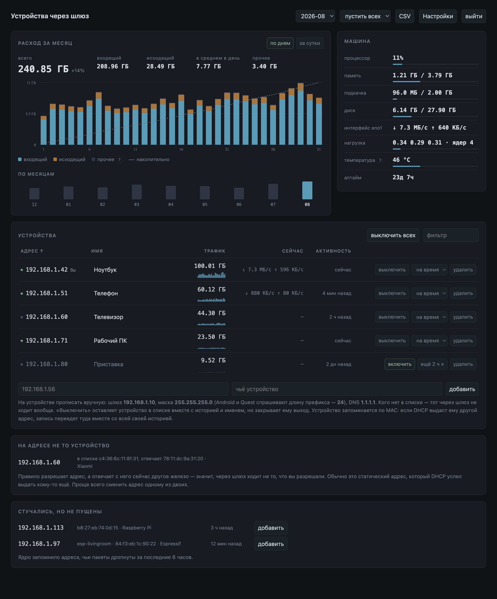

# gateway-acl

Небольшая веб-панель, которая решает, **каким устройствам сети можно ходить
через этот Linux-хост**, и показывает, сколько трафика каждое из них
израсходовало.

Подойдёт любой машине с Linux, которую остальные устройства прописывают себе
шлюзом: свободному компьютеру, одноплатнику, виртуалке, роутеру с обычным
дистрибутивом. Куда она выпускает трафик — в туннель или напрямую — неважно,
задача одна: указать этот адрес может кто угодно. Это и есть список допущенных.

```
устройство ──► этот Linux-хост ──► туннель или обычный выход ──► интернет
                     │
                     └── gateway-acl решает, кого пускать
```



*Скриншот снят на вымышленных устройствах и цифрах — настоящих данных здесь нет.*

## Что умеет

- **Список по IP.** Кого нет — тот не маршрутизируется. Одна таблица nftables,
  пересобирается целиком и атомарно на каждое изменение.
- **Трафик по устройствам**, входящий и исходящий, копится подённо и суммируется
  за месяц. График по дням с накопительной линией поверх, последние сутки,
  столбик на каждый месяц, спарклайн в каждой строке и любое одно устройство
  отдельно — раскройте его строку и нажмите «Показать в графике». Всё
  inline-SVG, без единой внешней библиотеки.
- **Скорость сейчас.** Тот же опрос, что копит счётчики, делит их на пройденное
  окно — и строка говорит, что устройство тянет прямо в эту минуту.
- **Сама машина.** Процессор, память, подкачка, диск, нагрузка, температура,
  аптайм и пропускная способность интерфейса — прямо из `/proc` и `/sys`.
- **Выключить устройство**, не удаляя: имя и статистика остаются на месте.
- **...или выключить на время.** Раскройте строку — там меню: пятнадцать
  минут, час, три, восемь или до семи утра. Когда срок выйдет, устройство само
  вернётся в то состояние, в котором стояло. В обратную сторону работает так же:
  выключенное можно выпустить на час.
- **...или выпустить мимо VPN, а не выключать.** Переключатель в той же строке
  уводит одно устройство в обход туннеля: интернет у него остаётся — напрямую
  через шлюз, — пока всё остальное идёт внутри. Его пакеты помечаются fwmark,
  которую туннель считает не своей: `"vpn_mark"` в `config.json`, `8228`
  (`0x2024`) для sing-box, `51820` для стандартного wg-quick, `0` — переключателя нет.
  Число берите со своего шлюза: соседняя метка делает ровно обратное. Метка
  ставится по MAC, поэтому IPv4 и IPv6 уходят вместе: наполовину выведенное из
  туннеля устройство любой сайт всё равно показывает на выходной ноде.
  Подробности в [docs/singbox.md](docs/singbox.md).
- **Устройство держится за свой MAC.** DHCP выдал знакомому устройству другой
  адрес — запись переезжает туда вместе с именем, переключателем и всей
  историей трафика, а не превращается тихо в правило ни для кого.
- **Пустить всех на время.** Управление — в Настройках: снимает список целиком
  на пять минут, пятнадцать или час — для гостей или для того, чтобы
  разобраться, почему что-то не подключается. Учёт при этом не прерывается, и
  ядро всё так же записывает, кто приходил: когда время выйдет, все, кто успел
  воспользоваться, окажутся в списке внизу — в одном клике от того, чтобы
  разрешить их насовсем.
- **Управлять туннелями из Настроек.** Можно добавлять и удалять сколько угодно
  HTTPS-подписок либо сохранять профили WireGuard и AmneziaWG в формате
  `.conf`. Новый профиль сначала выключен; при включении он проверяется, а при
  неудачном запуске панель возвращает прежний backend. Кнопка «проверить»
  отвечает, работает ли профиль, **не** переключая на него шлюз — так пул из
  нескольких подписок и профилей можно перебрать, ничего не сломав.
- **Выключить всех разом**, кроме адреса, с которого нажали. Та же кнопка
  возвращает всех обратно.
- **Предупреждение, когда на адресе отвечает не то устройство**: запись
  привязана к одному железу, а на адресе сейчас другое — значит, правило,
  написанное для планшета, работает сейчас на того, кто занял его адрес.
- **Неопознанные.** Ядро складывает тех, кого дропнуло, в set с таймаутом —
  панель показывает их, подставляя имя из аренд DHCP, аппаратный адрес из
  ARP-кэша и производителя: из системного списка IEEE, если он в системе есть,
  иначе из короткой встроенной таблицы. Говорит, когда адрес стучался в
  последний раз, и даёт разрешить в один клик. Поле для нового адреса
  подсказывает всё, что система знает про сеть, — по памяти вводить не нужно.
- **Переименование** прямо в строке — или взять то имя, которым устройство
  представляется сети: оно предлагается в конце поля, пока то пустое.
  Переименование не трогает nftables, поэтому счётчики целы. Список
  сортируется по адресу, имени, трафику, текущей скорости или активности —
  выбором из меню, направление меняется отдельной кнопкой, — фильтруется по
  адресу, имени и сетевому имени, и выгружается в CSV за выбранный месяц.
- **Уведомление об обновлении и кнопка под ним.** Раз в сутки панель спрашивает
  у GitHub тег последнего релиза и, если ваш старее, показывает баннер.
  «Установить сейчас» скачает релиз и прогонит установщик с теми ответами, что
  вы уже дали, — терминал не нужен. Выключается одной галочкой. Рядом —
  «проверить обновление»: спрашивает прямо сейчас, даже с выключенным
  уведомлением. Часто не стоит: GitHub считает запросы с одного адреса
  (шестьдесят в час), поэтому второй проверки в ту же минуту панель не делает.
- **Уведомление браузера, когда релиз вышел.** Вторая галочка под первой: пока
  вкладка панели открыта, о новой версии скажет уведомление рабочего стола, а
  не баннер, который ещё надо заметить. Уведомления браузер выдаёт только в
  защищённом контексте, поэтому по обычному `http://` на адрес в сети их нет —
  там в заголовке вкладки появляется точка. Про версию говорится один раз, а не
  при каждом опросе.
- **Настройки в углу.** Язык, уведомление об обновлениях и его дубль в
  браузере, период опроса,
  интерфейс, сеть, адрес шлюза, порт и пароль — весь `config.json` одной формой,
  с проверкой до записи. Рядом с кнопкой сохранения — перезагрузка самого
  шлюза, с подтверждением.
- **Ребут по расписанию** — переключателем, по умолчанию выключен; когда
  включаете, время уже стоит на 5:30.
- **Светлая и тёмная тема** — та, на которую настроена машина, с которой
  смотрят, или выбор вручную в Настройках: Авто, Светлая или Тёмная — держится
  в этом браузере. Если положить панель на домашний экран телефона, у неё будет
  свой значок, а строка состояния покрасится в цвет страницы.

Всё на стандартной библиотеке Python и inline-SVG. Ни pip, ни npm, ни CDN —
панель работает даже когда интернета нет вовсе.

## Что нужно

- Linux с systemd и `nftables`
- Python 3.9+ (хватит стандартной библиотеки)
- Для управляемых туннелей нужны `sing-box` 1.12+, `wg-quick` и `awg-quick` —
  установщик предложит их поставить. Обычный NAT или другой уже настроенный
  маршрут работает и без них.

## Установка

```bash
git clone https://github.com/ChasoniCK/gateway-acl
cd gateway-acl
sudo ./install.sh
```

Первый вопрос — язык, русский или английский. Он задаёт и вывод самого
установщика, и интерфейс панели, и запоминается в `config.json`, поэтому при
обновлении спрашивать больше не будут. Чтобы не спрашивал вовсе:

```bash
sudo ./install.sh --lang en
```

Установщик сам определит интерфейс, адрес и сеть, предложит включить
`ip_forward`, спросит пароль панели, а при первой установке покажет устройства,
которые сейчас видны в ARP-таблице, чтобы вы разрешили их **до** того, как
правило вступит в силу. Ничего не включается, пока не пройдёт
`panel.py --selftest` и пока ядро не примет сгенерированный ruleset.

Отдельным шагом установщик доставляет программы, которыми панель запускает
туннели: `sing-box` (только 1.12 и новее — конфиг, который пишет панель, старые
версии не читают; если в дистрибутиве лежит устаревший, ставится опубликованная
сборка под эту архитектуру в `/usr/local/bin` вместе с юнитом systemd),
`wireguard-tools` и, если он вообще где-то упакован, `amneziawg-tools`. Ни одна
неудача этого шага не отменяет установку панели: сеть провайдера, которой сейчас
нет, не должна стоить вам управления доступом. Подписки установщик по-прежнему не
скачивает и конфиги туннелей не переписывает — этим занимается только панель.

Туннели настраиваются в **Настройки → Туннели**. Если чего-то из перечисленного
на шлюзе нет, панель называет это прямо в списке туннелей — раньше единственным
следом было «нужная программа не установлена» на каждой попытке включения.

У каждой подписки своя HTTPS-ссылка и необязательное регулярное выражение для
исключения узлов. Несколько подписок можно включить вместе: их узлы объединяются
в одну группу sing-box `proxy`, а каждый источник обновляется и удаляется
отдельно. Группа — `urltest`, поэтому домашние узлы по-прежнему важно исключать:
ближайший побеждает по задержке, и туннель выходит там же, где вошёл.

Прочитайте имена, прежде чем писать выражение. Имя от провайдера говорит, где в
узел **входят**, а не откуда выходят: `Россия (Reality)` выходит в России, а
`Россия через Финляндию` входит там и выходит в Финляндии — и вторые сплошь и
рядом единственные, что работают, потому что провайдер блокирует как раз прямые
зарубежные адреса. `Россия \(` уберёт первые и оставит вторые; `Росс` уберёт и
те и другие, и подключиться будет нечем.

Панель пишет подчёркнуто мало: outbound'ы с тегами своего профиля подписки и
состав группы `proxy`.
Правила маршрутизации, DNS, inbound'ы и любые вписанные вручную outbound'ы
переживают обновление подписки без единой правки, а прежний конфиг остаётся
рядом с новым. Узел, который этот sing-box не умеет — скажем, транспорт
`xhttp`, — будет назван и пропущен, а не записан. Если конфига нет вовсе,
создаётся рабочий: `tun` с `auto_route` и `auto_redirect`, DNS заворачивается в
туннель, приватные адреса уходят через `direct`.

Профиль WireGuard или AmneziaWG обязан содержать полный маршрут IPv4. Панель
отвергает `Table = off`, свою таблицу, все хуки `PreUp`/`PostUp`/`PreDown`/`PostDown`
и `SaveConfig`. Отсутствие `::/0` показывается как предупреждение про IPv6.
Запускаются только фиксированные команды `wg-quick`/`awg-quick`; текст конфига
никогда не исполняется как shell-команда.

Кнопка **проверить** есть у каждого профиля и ничего не переключает — она
отвечает на вопрос «а этот заработает», пока текущий туннель продолжает
работать. Подписка собирается в отдельный конфиг, отдаётся `sing-box check` на
разбор, и её узлы (до 24 разных адресов, все сразу) опрашиваются по TCP:
в списке появляется «отвечают 21 из 24». Профиль WireGuard или AmneziaWG
поднимается на временном интерфейсе с единственным маршрутом в `192.0.2.1` —
адрес из блока, зарезервированного под документацию, туда не ходит ничего
настоящего, — панель посылает через него один пакет, ждёт рукопожатия и удаляет
интерфейс. Так профили можно набрать пулом и разобраться, какой из них живой,
не переключая на каждый весь шлюз.

Одновременно работает один класс backend: общая группа подписок sing-box, один
профиль WireGuard, один AmneziaWG либо прямой маршрут. При переключении панель
сначала закрывает транзит, проверяет кандидата, записывает настоящую fwmark и
только потом открывает трафик. Поднятому туннелю даётся до двадцати секунд, чтобы
появиться: `systemctl restart` возвращает управление, как только процесс запущен,
а маршрут и метку sing-box ставит мгновением позже — проверка сразу же видела
здоровый туннель как несостоявшийся и откатывала всё переключение. При ошибке
возвращаются прежние конфиг, служба и метка; если не удался сам откат, транзит
остаётся закрыт. Самостоятельное падение туннеля замечается на следующем опросе
панели, не мгновенно.

Метаданные лежат в `/etc/gateway-acl/tunnels.json`, а ссылки, кэш подписок и
quick-конфиги — в доступных только root файлах под `/etc/gateway-acl/tunnels/` и
никогда не возвращаются браузеру. Прежние `sub.url`/`sub.exclude` мигрируют один
раз без изменения работающей службы sing-box; нажмите «обновить» в панели, когда
будете готовы передать ей управление. Подробности — в
[docs/singbox.md](docs/singbox.md).

Повторный запуск обновляет код на месте: список устройств и статистика не
трогаются. Все ответы берутся из уже лежащего `config.json`, а не определяются
заново по хосту, — именно поэтому `--yes` безопасен на машине, настроенной
руками.

```bash
sudo ./install.sh --uninstall   # снять службу и правила, данные оставить
sudo ./install.sh --purge       # плюс удалить /etc/gateway-acl
```

## Настройка клиента

На каждом устройстве прописать вручную:

| | |
|---|---|
| Шлюз | адрес этого хоста |
| Маска | маска вашей сети (Android и Quest спрашивают длину префикса) |
| DNS | публичный резолвер, например `1.1.1.1` |

Не указывайте клиентам в качестве DNS адрес самого шлюза — почему это тихо
ломается, написано в [docs/singbox.md](docs/singbox.md).

## О безопасности, без прикрас

Панель доступна из всей локальной сети и закрыта **одним паролем**.

- Хранится как scrypt со случайной солью, открытым текстом — нигде. Установщик
  считывает пароль и сразу передаёт его в `panel.py --set-password`.
- Кука сессии — `HttpOnly`, `SameSite=Strict`, семь дней. Сессии лежат
  в `sessions.json` (режим 0600) в виде хешей, поэтому переживают перезапуск
  службы — обновление больше не разлогинивает, — а утёкший файл сам по себе
  ничего не открывает: то, что в нём, куки не заменяет. «Выйти» гасит сессию
  по-настоящему.
- Пять промахов с одного адреса — минута отдыха для этого адреса.

**Это обычный HTTP.** Пароль идёт по сети открытым текстом. В небольшой сети,
которую вы контролируете, размен приемлемый; в чужой — нет. Тогда ставьте
TLS-прокси перед панелью или ходите через SSH-туннель:

```bash
ssh -L 8080:127.0.0.1:8080 you@gateway
```

Кто знает пароль — тот меняет список. Ролей и журнала действий нет: инструмент
рассчитан на сеть, где пароль есть у всех, кому он и должен быть.

**Кнопка обновления запускает код от root.** Когда плашка сообщает о новом
релизе, «Установить сейчас» скачивает его с `codeload.github.com` и запускает
`install.sh --yes` с теми ответами, что уже лежат на диске. Адрес собран из
констант: из сети приходит только тег, и он обязан выглядеть как версия, иначе
не скачивается ничего. Архив должен назвать ту же версию, о которой объявили, и
пройти собственный selftest — только после этого на хосте что-то меняется; как
всё прошло, видно в `/etc/gateway-acl/update.log`. И всё же это ещё одна
возможность, которую даёт пароль панели: тот, кто его знает, может заставить
шлюз поставить релиз. Кнопка перезагрузки всегда давала власть того же порядка,
но лучше сказать это прямо, чем обнаружить.

**Наружу панель ходит раз в сутки и по нажатию кнопки** — GET на
`api.github.com/repos/ChasoniCK/gateway-acl/releases/latest`, чтобы узнать тег
последнего релиза. Ничего о вас не отправляется, но сам факт запроса виден
GitHub — это ваш IP и время. По умолчанию проверка включена, галочка — под
кнопкой **Настройки** в углу панели, действует сразу. Там же «проверить
обновление» делает тот же запрос вручную — другого исходящего трафика у панели
нет, так что чаще, чем вы нажимаете, его не будет. На шлюзе без интернета запрос
просто не удаётся: суточная проверка молчит, кнопка об этом говорит.

## Настройки

Всё, что лежит в `config.json`, правится из панели: язык, уведомление об
обновлениях и уведомление браузера о них, период опроса счётчиков, интерфейс локальной сети, сама сеть,
адрес шлюза в ней, порт панели и пароль. Форма проверяется целиком до записи:
сеть с ненулевыми битами хоста, адрес шлюза вне своей же сети, несуществующий
интерфейс или занятый порт — отказ, и ничего не сохраняется.

Язык, уведомление, период опроса и пароль применяются сразу. Смена сети тут же
пересобирает правила nftables. Только смена порта требует перезапуска процесса —
панель делает его сама и говорит новый адрес.

Профили туннелей лежат отдельно, в закрытом каталоге, а не в `config.json`.
Их управление загружается только при открытии Настроек; обычная страница с
устройствами никогда не получает ссылку подписки, её кэш, приватный или
предварительно согласованный ключ.

## Как устроено

Одна таблица nftables `inet gwacl` на хуке `prerouting` с приоритетом `raw`
(−300) — намеренно раньше цепочек перенаправления, которые ставит туннель.
Пакеты с адреса не из списка дропаются, кроме адресованных самому хосту, так что
**SSH остаётся доступен** даже с устройства, которое вы только что закрыли.

Подробности — почему учёт переживает обнуление счётчиков и как проверить ruleset,
не трогая рабочую машину: [docs/design.md](docs/design.md).

## Ограничения

- Только IPv4. IPv6 пропускается как есть.
- Для управляемого quick-профиля нужен полный маршрут IPv4 и установленная
  подходящая программа. Ставит их установщик, а не работающая панель: панель
  называет недостающее, но сама ничего не скачивает. Хуки и собственные таблицы
  маршрутизации из профиля она не поддерживает и отказывается переключаться,
  пока найден чужой туннель с default route.
- Во время переключения из панели транзит закрыт транзакционно. Если backend
  упал сам, прямой трафик может пройти до следующего опроса; раннего kill-switch
  до запуска gateway-acl после загрузки система не обещает.
- В цифры попадает и трафик до самого хоста (SSH, сама панель).
- Таймер точен настолько же, насколько период опроса: устройство, которому
  назначено вернуться в 07:00, вернётся на первом опросе после этого времени.
  То же и с переездом по DHCP — панель замечает его на очередном опросе, а не в
  момент смены аренды, и только у того устройства, чей адрес есть в ARP-кэше.
  Устройство, которое кэш видит сразу на нескольких адресах — а именно это
  остаётся после смены адреса руками, — панель не переносит вовсе, пока аренда
  DHCP не скажет, какой из них нынешний: запись остаётся там, куда её поставили.
- Переехавшее устройство сохраняет историю, но не счётчики: два именованных
  счётчика принадлежат адресу, и на новом они начинаются с нуля.
- Открытый шлюз записан в конфиг и переживает перезапуск службы — в этом и
  смысл, но это же значит, что закрыть вкладку не значит закрыть шлюз. Он
  закроется сам, когда выйдет срок; дольше шести часов держать открытым нельзя.
- Производитель — подсказка, а не факт: полный список IEEE, если система его
  везёт (`ieee-data`, wireshark), иначе короткая встроенная таблица, знающая
  только самое ходовое. Телефоны, которые придумывают себе адрес на каждую
  сеть, так и подписаны — в выдуманном адресе производителя нет.
- Выключенному устройству капают единицы килобайт его собственных ретраев.
- Выпустить устройство мимо VPN — это метка и ничего больше. Считается ли она
  туннелем, решает туннель, а его эта программа не настраивает и спросить не
  может. Неверная `vpn_mark` не падает с ошибкой и может промахнуться не в
  безопасную сторону: соседняя с нужной `0x2023` у sing-box загоняет устройство
  *в* туннель. Проверьте один
  раз с самого устройства и **оба протокола**: `curl -4 https://api.ipify.org` и
  `curl -6 https://api6.ipify.org` должны показать ваш собственный адрес — либо
  IPv6 не должен отвечать вовсе. Если IPv6 в сети есть только из туннеля,
  устройство остаётся без него, а не ходит по нему в обход; трафик берёт на себя
  IPv4.
- История трафика привязана к адресу и переживает удаление устройства. Байты
  удалённых остаются в итогах месяца — панель показывает их отдельной долей
  «прочее», приписать их уже некому.
- Счётчики копятся в памяти и попадают в `today.json` не чаще раза в пять минут;
  закрытые дни лежат отдельно, в `traffic.json`, который переписывается только
  на смене суток. Поэтому запись текущего дня стоит около килобайта, а не всей
  истории — меньше полумегабайта в сутки на флешку машины, которую никогда не
  выключают. Штатная остановка и даже падение процесса ничего не теряют —
  базовая линия на диске ровно настолько же старая, насколько итоги рядом с ней,
  и следующий опрос досчитает разницу. Потерять до пяти минут учёта может только
  внезапная перезагрузка: там вместе с памятью обнуляются и счётчики ядра.
- График по дням остаётся за три последних месяца — «хранить по дням» в
  настройках, от 1 до 24. Всё, что старше, панель сворачивает в один итог за
  месяц: суммы и столбики по месяцам точны до байта, а разбивки по дням за
  старые месяцы больше нет. Уменьшение срока сворачивает лишнее сразу при
  сохранении формы.

## Лицензия

MIT — см. [LICENSE](LICENSE).
